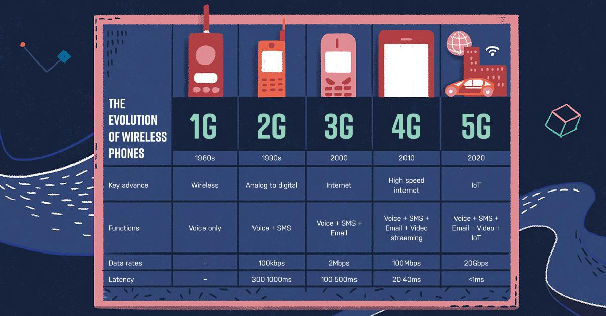
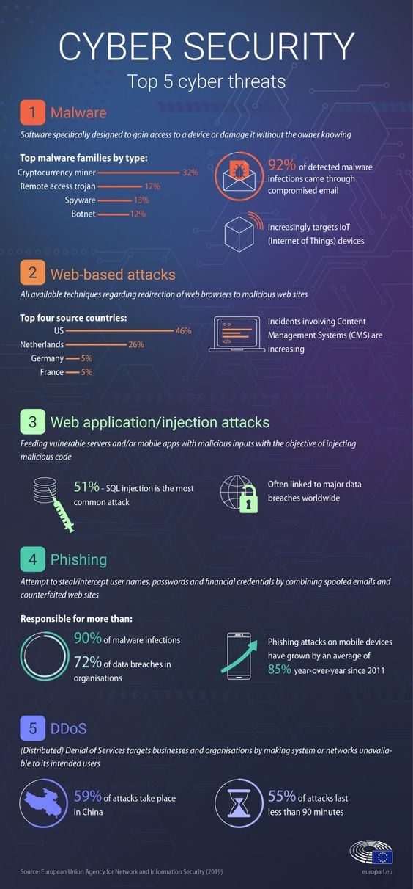
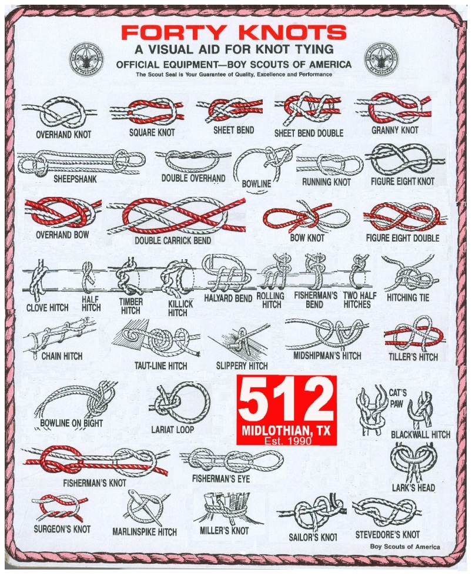
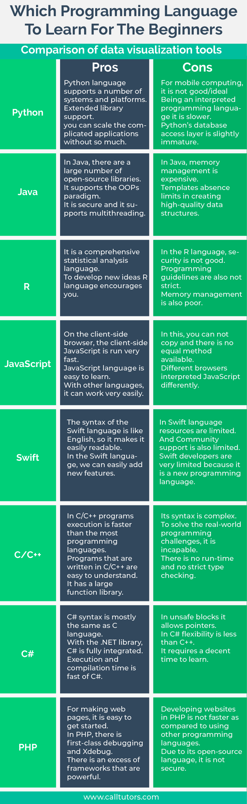
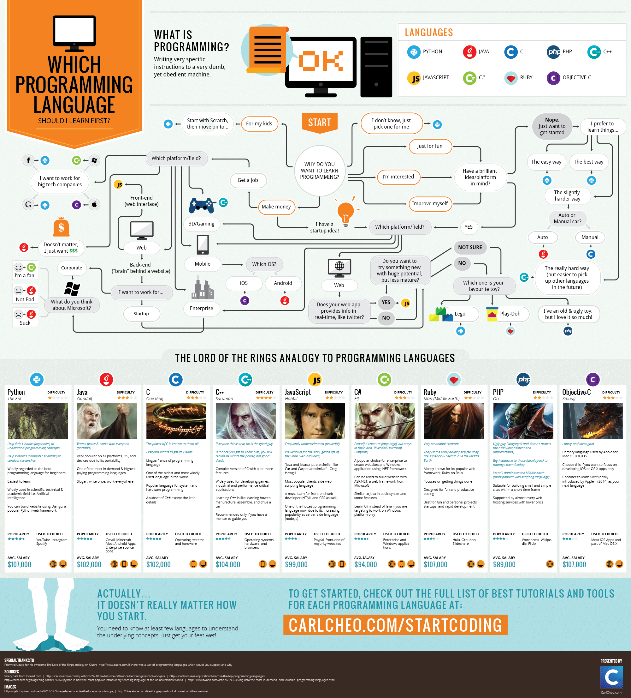
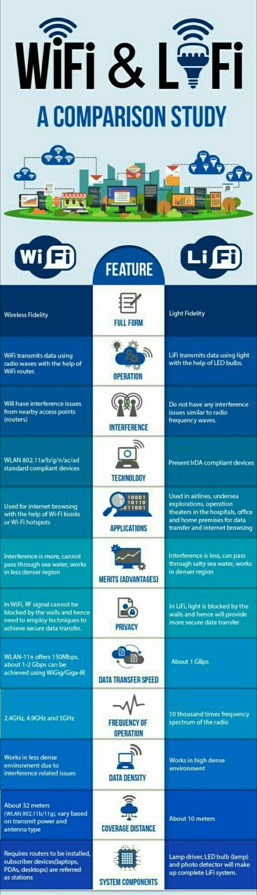
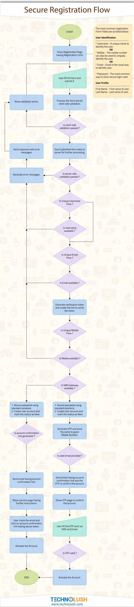
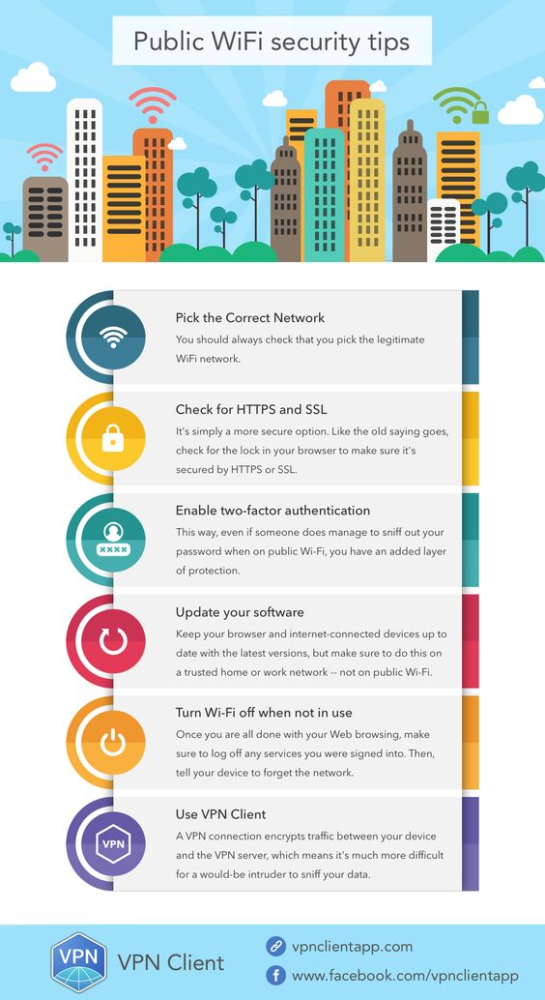

Infographics Gallery
====================

These are various infographics I've found around Reddit, mostly,
and collected here. They are here in part as a way of testing
an approach to using Bittorrent-over-I2P as a peer-to-peer way
of backing the resources on the site.

 - 
 - 
 - 
 - 
 - 
 - 
 - 
 - 
 - 
 - 
 - 
 - 
 - 
 - 
 - 
 - 
 - 
 - 
 - 
 - 
 - 
 - 
 - 
 - 
 - 
 - 
 - 
 - 
 - 
 - 
